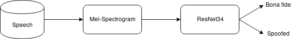
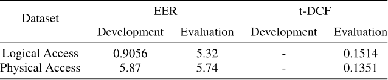

Automatic Speaker Verification systems are gaining popularity these days; spoofing attacks are of prime concern as they make these systems vulnerable. Some spoofing attacks like Replay attacks are easier to implement but are very hard to detect thus creating the need for suitable countermeasures.

This project propose a speech classifier based on deep-convolutional neural network to detect spoofing attacks. Our proposed methodology uses acoustic time-frequency representation of power spectral densities on Mel frequency scale (Mel-spectrogram), via deep residual learning (an adaptation of [ResNet-34](https://arxiv.org/abs/1512.03385) architecture). Using a single model system, we have achieved an equal error rate (EER) of 0.9056% on the development and 5.32% on the evaluation dataset of logical access scenario and an equal error rate (EER) of 5.87% on the development and 5.74% on the evaluation dataset of physical access scenario of [ASVspoof 2019](asvspoof.org).

Comparing the result of ASVspoof 2019 challenge, our single model outperforms the baseline models provided by ASVspoof 2019 organizers.
### Dataset
Dataset is available [here](https://doi.org/10.7488/ds/2555).

### Libraries used
- [fast.ai](https://www.fast.ai/)
- [librosa](https://pandas.pydata.org/)
- [pandas](http://librosa.github.io/librosa/)

### Methodology

### Results
Received from asvspoof organizing committee.

### Modifications
- Include F1score metric.
- Balancing classes in the dataset.
